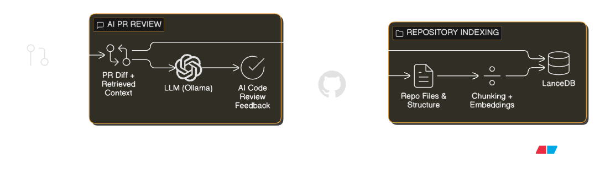

# AI Code Reviews — Context-Aware GitHub App

**AI Code Reviews** is a **context-aware GitHub App** that performs intelligent code reviews by understanding the **entire repository**, not just the lines changed in a pull request.

Unlike traditional AI reviewers that only analyze diffs, this product builds a **semantic understanding of the full codebase** using embeddings and a vector database, enabling **high-quality, relevant, and maintainable review suggestions**.

---

## Product Vision

Modern code reviews require **context**:
- Existing architecture
- Utility functions
- Design patterns
- Prior implementation decisions

**AI Code Reviews** solves this by indexing the full repository and using **Retrieval-Augmented Generation (RAG)** to deliver reviews that feel like they came from a senior engineer who already knows the codebase.

---

## Key Features

### GitHub App Integration
- Install the app on a selected repository
- Secure GitHub App authentication
- Fine-grained repository permissions

### Repository-Level Intelligence
- Fetches full repository structure and source code
- Converts code into vector embeddings
- Stores embeddings in a vector database for fast semantic retrieval

### Context-Aware Pull Request Reviews
- Listens to pull request webhooks
- Fetches PR diffs automatically
- Retrieves **relevant historical code context**
- Sends PR diff + context to an LLM for review

### Cost-Efficient AI
- Uses **local LLMs and embeddings via Ollama**
- No dependency on paid APIs
- Fully self-hostable AI pipeline

---

## Product Architecture

